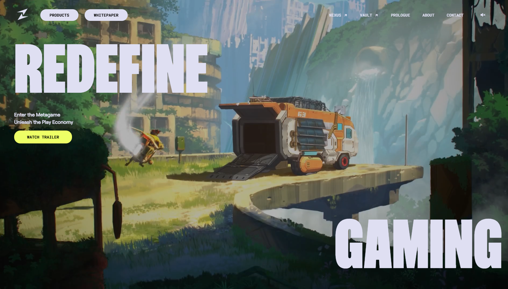

# Zentry Clone



## 📖 About the Project

This is a **clone** of the homepage of **[Zentry.com](https://zentry.com/)**, created for **educational purposes only**. The goal of this project was to replicate the design and functionality of the original site as closely as possible, while enhancing my front-end development skills. You can view the site live here **[https://huzaifa-zentry-clone.vercel.app/](https://huzaifa-zentry-clone.vercel.app/)**

## 🚀 Features

- Fully responsive layout resembling Zentry.com
- Background music with **play/pause toggle**
- Smooth animations and transitions
- Navigation bar and UI elements cloned from the original homepage

## 🛠️ Technologies Used

- **HTML** – Structure
- **CSS** – Styling and layout
- **JavaScript** – Interactivity
- **Remix Icons** – Icons used for UI elements

## 📥 Installation & Usage

1. **Clone the repository**
   ```bash
   git clone https://github.com/yourusername/zentry-clone.git
   ```
2. **Open the project folder**
   ```bash
   cd zentry-clone
   ```
3. **Open `index.html` in a browser**

## 📸 Screenshots


## 🎯 Challenges & Learnings

### **Challenges Faced:**

- Replicating animations, interactivity, and layout of an **Awwwards-winning site**
- Handling the **background music controls** and transitions
- Ensuring the design was **responsive** across various screen sizes

### **What I Learned:**

- Advanced **CSS animations & transitions**
- Managing **audio controls in JavaScript**
- Debugging **layout inconsistencies** across devices

## 📢 Disclaimer

This project is a **fan-made educational clone** and is **not affiliated with Zentry.com** in any way. All rights to the original design and assets belong to Zentry.

## 🚀 Future Improvements

Currently, there are no planned future improvements unless I decide to showcase the project in my portfolio.

## 💡 Author

**Huzaifa Akhtar**  
[GitHub Profile](https://github.com/HuzaifaAkhtar2) | [Portfolio Site](https://huzaifa-portfolio.pages.dev/)
